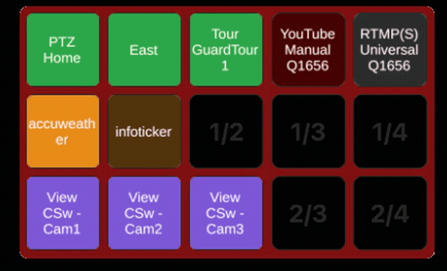
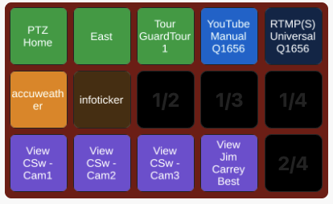
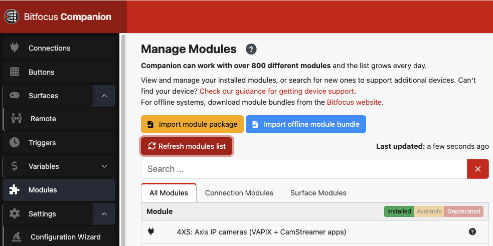
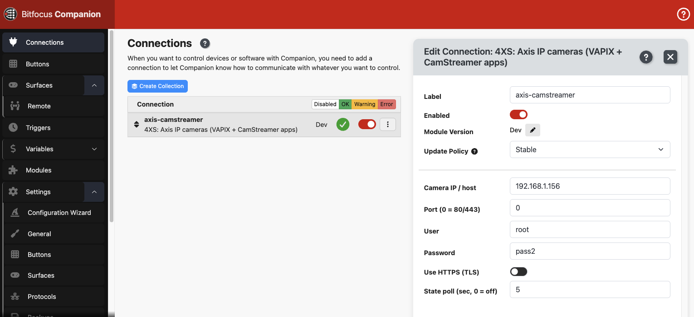
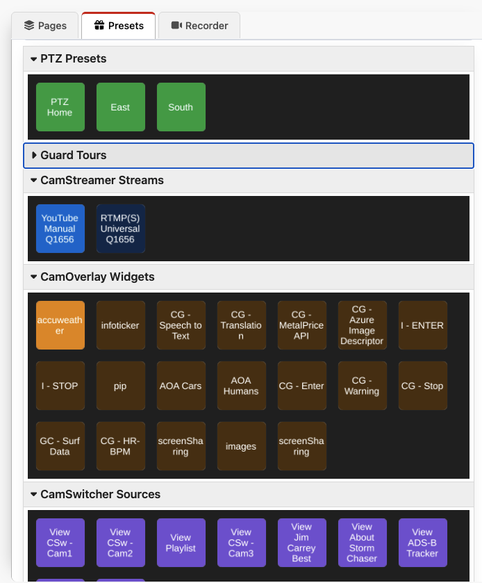
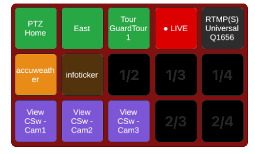

# Axis IP Cameras for Bitfocus Companion

**Control your Axis cameras and CamStreamer apps from a Stream Deck — or right from your screen.**

A free, open-source [Bitfocus Companion](https://bitfocus.io/companion) module that talks
directly to Axis cameras over your network. Recall PTZ presets, run guard tours, start and
stop live streams with a blinking on-air tally, toggle overlays, and switch views — every
button shows the camera's real, live status.

<p align="center">
  
</p>

> 🌐 **Project page & download:** https://kotyza.github.io/companion-module-axis-camera-control/

---

## What it can do

| | |
|---|---|
| 🎯 **PTZ Presets** | Recall server presets and Home, per camera view-area. |
| 🔄 **Guard Tours** | Start, stop or toggle AXIS guard tours. |
| 📡 **CamStreamer Streams** | Start / stop / toggle streams — buttons light up when on air. |
| 🔴 **Blinking Tally** | Broadcast-style red **● LIVE** button that flashes while streaming. |
| 🖼️ **CamOverlay Widgets** | Show or hide overlay graphics without disturbing the others. |
| 🎬 **CamSwitcher Sources** | Switch the active view / playlist with one press. |
| ✅ **Live Feedback** | Buttons reflect what the camera is really doing, even if changed elsewhere. |
| 🔐 **Works out of the box** | Digest & basic auth — enter your camera login once. |

Drag-and-drop **presets** are generated automatically from your own camera (your real
preset names, streams, overlays and views), colour-coded so a finished page looks like this:

<p align="center">
  
</p>

## Install

No coding required.

1. **Download** the latest module package (`.tgz`) from the
   [project page](https://kotyza.github.io/companion-module-axis-camera-control/) or the
   [Releases](https://github.com/kotyza/companion-module-axis-camera-control/releases) tab.
2. In Companion, open **Modules → Import module package** and select the `.tgz`.
3. Go to **Connections → Add connection**, search **4XS** or **Axis**, and add it.
4. Enter your **Camera IP**, **User** and **Password**. The status turns green and all the
   actions and presets appear.
5. Open the **Presets** tab and drag buttons onto your grid.

<p align="center">
  
</p>

Requires Bitfocus Companion 3.0 or newer (tested on 4.3.4) and a network connection to the
camera. Your login is stored encrypted by Companion. CamStreamer / CamOverlay / CamSwitcher
actions only apply if those apps are installed on the camera.

## Screenshots

| Connection | Presets | Live tally |
|---|---|---|
|  |  |  |

---

## For developers

Node 22 / TypeScript. The module runs as an isolated process, so a fault can't take down
Companion. `src/camera.ts` is a TypeScript port of the camera command layer shared with the
Stream Deck / Macro Deck plugins, with built-in digest + basic auth.

```bash
git clone https://github.com/kotyza/companion-module-axis-camera-control.git
cd companion-module-axis-camera-control
npm install
npm run build      # -> dist/main.js
npm run package    # -> axis-camera-control-x.y.z.tgz
```

For live development, set Companion's **Developer modules path** to the folder containing
this module and run `npm run dev`.

```
src/main.ts        connect, discover, poll, blink driver
src/camera.ts      VAPIX / CamStreamer / CamOverlay / CamSwitcher client + auth
src/config.ts      connection settings
src/actions.ts     the five actions
src/feedbacks.ts   stream / overlay / tour state + tally
src/presets.ts     auto-generated drag-and-drop presets
```

## License & credits

MIT © [4XS / Pavel Kotyza](https://github.com/kotyza). Part of the “Stream Deck on Axis”
family (Elgato Stream Deck, Touch Portal, Macro Deck & Companion). Not affiliated with Axis
Communications or Bitfocus.
